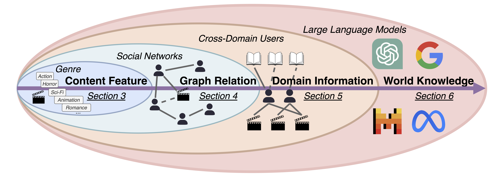

# Awesome-Cold-Start-Recommendation

<div align="center">

</div>

<div align="center">
    <a href="https://awesome.re"></a>
    <a href="http://makeapullrequest.com"></a>
    <a href="http://makeapullrequest.com"></a>
</div>

📚 This repository contains a curated list of papers on **cold-start recommendation (CSR)**, based on the survey paper "[Cold-Start Recommendation towards the Era of Large Language Models (LLMs): A Comprehensive Survey and Roadmap](https://arxiv.org/pdf/2501.01945)". We hope to provide a more comprehensive literature base for the cold-start recommendation research and industrial community.

*Continuously updating!*

🤗 Welcome to update this repository by launching an issue or a pull request if you find any missing resources or want to include some new papers.

- [Awesome-Cold-Start-Recommendation](#awesome-cold-start-recommendation)
  - [Taxonomy](#taxonomy)
    - [Content Features](#content-features--back-to-top)
      - [Data Incomplete Learning](#data-incomplete-learning)
        - [🚩 Robust Co-Training](#-robust-co-training)
        - [🚩 Knowledge Alignment](#-knowledge-alignment)
        - [🚩 Cold Exploration](#-cold-exploration)
        - [🚩 Feature Similarity Measurement](#-feature-similarity-measurement)
      - [Data Efficient Learning](#data-efficient-learning)
        - [🚩 Meta-Learning Optimization](#-meta-learning-optimization)
        - [🚩 Meta-Task Utilization](#-meta-task-utilization)
        - [🚩 Meta-Embedding Initialization](#-meta-embedding-initialization)
        - [🚩 Sequtial Meta-Learning](#-sequtial-meta-learning)
    - [Graph Relations](#graph-relations-back-to-top)
      - [Interaction Graph Enhancement](#interaction-graph-enhancement)
        - [🚩 Supplementary Graph Relation](#-supplementary-graph-relation)
        - [🚩 Homophily Network Relation](#-homophily-network-relation)
      - [Graph Relation Extension](#graph-relation-extension)
        - [🚩 Heterogeneous Graph Relation](#-heterogeneous-graph-relation)
        - [🚩 Attributed Graph Relation](#-attributed-graph-relation)
        - [🚩 Knowledge Graph Relation](#-knowledge-graph-relation)
      - [Graph Aggregator Improvement](#graph-aggregator-improvement)
        - [🚩 Aggregation Scope Expansion](#-aggregation-scope-expansion)
        - [🚩 Information Aggregator Augmentation](#-information-aggregator-augmentation)
    - [Domain Information](#domain-information-back-to-top)
      - [Domain Knowledge Transfer](#domain-knowledge-transfer)
        - [🚩 Embedding Mapping](#-embedding-mapping)
        - [🚩 Heterogeneous Connection](#-heterogeneous-connection)
        - [🚩 Learning Process](#-learning-process)
      - [Domain Distribution Alignment](#domain-distribution-alignment)
        - [🚩 Collaborative Filtering Alignment](#-collaborative-filtering-alignment)
        - [🚩 Auxiliary Feature Alignment](#-auxiliary-feature-alignment)
      - [Domain-Invariant Representation Learning](#domain-invariant-representation-learning)
        - [🚩 Disentangled Representation](#-disentangled-representation)
        - [🚩 Fusing Representation](#-fusing-representation)
    - [World Knowledge from LLMs](#world-knowledge-from-llms-back-to-top)
      - [LLMs as the Recommender System](#llms-as-the-recommender-system)
        - [🚩 Prompting LLMs for Recommendation](#-prompting-llms-for-recommendation)
        - [🚩 Efficient Tuning LLMs for Recommendation](#-efficient-tuning-llms-for-recommendation)
      - [LLMs as the Knowledge Enhancer](#llms-as-the-knowledge-enhancer)
        - [🚩 LLMs for Representation Enhancement](#-llms-for-representation-enhancement)
        - [🚩 LLMs for Relation Augmentation](#-llms-for-relation-augmentation)
  - [Research Papers Sorted by Published Time](#research-papers-sorted-by-published-time)
    - [Year 2025](#year-2025-back-to-top)
    - [Year 2024](#year-2024-back-to-top)
    - [Year 2023](#year-2023-back-to-top)
    - [Year 2022](#year-2022-back-to-top)
    - [Year 2021](#year-2021-back-to-top)
    - [Year 2020 \& Before](#year-2020--before-back-to-top)
  - [Survey Papers](#survey-papers)
  - [Open-Source Toolkit](#open-source-toolkit)
  - [Citation](#citation)

-----
## Taxonomy

### Content Features  [[Back to Top](#awesome-cold-start-recommendation)]

#### Data Incomplete Learning
##### 🚩 Robust Co-Training

- (AAAI 2024) **Temporally and Distributionally Robust Optimization for Cold-start Recommendation** [[Paper]](https://arxiv.org/pdf/2312.09901.pdf) [[Code]](https://github.com/Linxyhaha/TDRO)
  
- (PAKDD 2024) **Collaborative Filtering in Latent Space: A Bayesian Approach for Cold-Start Music Recommendation** [[Paper]](https://link.springer.com/chapter/10.1007/978-981-97-2262-4_9)

- (MM 2023) **GoRec: A Generative Cold-Start Recommendation Framework** [[Paper]](https://le-wu.com/files/Publications/CONFERENCES/MM23-GoRec-bai.pdf) [[Code]](https://github.com/HaoyueBai98/GoRec)

- (WWW 2022) **Alleviating Cold-start Problem in CTR Prediction with A Variational Embedding Learning Framework** [[Paper]](https://arxiv.org/pdf/2201.10980.pdf)

- (SIGIR 2022) **Transform Cold-Start Users into Warm via Fused Behaviors in Large-Scale Recommendation** [[Paper]](https://dl.acm.org/doi/abs/10.1145/3477495.3531797)

- (SIGIR 2022) **Improving Item Cold-start Recommendation via Model-agnostic Conditional Variational Autoencoder** [[Paper]](https://arxiv.org/pdf/2205.13795.pdf) [[Code]](https://github.com/BestActionNow/CVAR)

- (CIKM 2021) **Zero Shot on the Cold-Start Problem: Model-Agnostic Interest Learning for Recommender Systems** [[Paper]](https://arxiv.org/pdf/2108.13592.pdf) [[Code]](https://github.com/LiangjunFeng/MAIL)

- (SIGIR 2020) **Recommendation for New Users and New Items via Randomized Training and Mixture-of-Experts Transformation** [[Paper]](https://dl.acm.org/doi/pdf/10.1145/3397271.3401178) [[Code]](https://github.com/Zziwei/Heater--Cold-Start-Recommendation)

- (MM 2020) **How to Learn Item Representation for Cold-Start Multimedia Recommendation?** [[Paper]](https://dl.acm.org/doi/pdf/10.1145/3394171.3413628) [[Code]](https://github.com/duxy-me/MTPR)

- (AAAI 2019) **From Zero-Shot Learning to Cold-Start Recommendation** [[Paper]](https://ojs.aaai.org/index.php/AAAI/article/download/4324/4202) [[Code]](https://github.com/lijin118/LLAE)

- (NeurIPS 2017) **DropoutNet: Addressing Cold Start in Recommender Systems** [[Paper]](https://proceedings.neurips.cc/paper_files/paper/2017/file/dbd22ba3bd0df8f385bdac3e9f8be207-Paper.pdf) [[Code]](https://github.com/layer6ai-labs/DropoutNet)


---

##### 🚩 Knowledge Alignment
- (SIGIR 2024) **CMCLRec: Cross-modal Contrastive Learning for User Cold-start Sequential Recommendation** [[Paper]](https://dl.acm.org/doi/pdf/10.1145/3626772.3657839)

- (AAAI 2024) **Preference Aware Dual Contrastive Learning for Item Cold-Start Recommendation** [[Paper]](https://ojs.aaai.org/index.php/AAAI/article/view/28763)

- (WWW 2023) **Contrastive Collaborative Filtering for Cold-Start Item Recommendation** [[Paper]](https://dl.acm.org/doi/pdf/10.1145/3543507.3583286) [[Code]](https://github.com/zzhin/CCFCRec)

- (SIGIR 2023) **Aligning Distillation For Cold-start Item Recommendation** [[Paper]](https://dl.acm.org/doi/10.1145/3539618.3591732) [[Code]](https://github.com/zfnWong/ALDI) 

- (BigData 2023) **Dual-Teacher Knowledge Distillation for Strict Cold-Start Recommendation** [[Paper]](https://ieeexplore.ieee.org/abstract/document/10386104/) [[Code]](https://github.com/DavidZWZ/DTKD_SCS)

- (DASFAA 2023) **Cold & Warm Net: Addressing Cold-Start Users in Recommender Systems** [[Paper]](https://arxiv.org/pdf/2309.15646)

- (CIKM 2023) **Self-supervised Contrastive Enhancement with Symmetric Few-shot Learning Towers for Cold-start News Recommendation** [[Paper]](https://dl.acm.org/doi/abs/10.1145/3583780.3615053)

- (SIGIR 2022) **Generative Adversarial Framework for Cold-Start Item Recommendation** [[Paper]](https://dl.acm.org/doi/abs/10.1145/3477495.3531897) [[Code]](https://github.com/zfnWong/GAR)

- (CIKM 2022) **Generative Adversarial Zero-Shot Learning for Cold-Start News Recommendation** [[Paper]](https://dl.acm.org/doi/pdf/10.1145/3511808.3557335)

- (CIKM 2022) **Revisiting Cold-Start Problem in CTR Prediction: Augmenting Embedding via GAN** [[Paper]](https://dl.acm.org/doi/10.1145/3511808.3557684)

- (MM 2021) **Contrastive Learning for Cold-Start Recommendation** [[Paper]](https://dl.acm.org/doi/pdf/10.1145/3474085.3475665) [[Code]](https://github.com/weiyinwei/CLCRec)


---

##### 🚩 Cold Exploration
- (WSDM 2023) **Meta Policy Learning for Cold-Start Conversational Recommendation** [[Paper]](https://dl.acm.org/doi/pdf/10.1145/3539597.3570443) [[Code]](https://github.com/zdchu/MetaCRS)

- (WWW 2023) **ColdNAS: Search to Modulate for User Cold-Start Recommendation** [[Paper]](https://dl.acm.org/doi/pdf/10.1145/3543507.3583344) [[Code]](https://github.com/LARS-research/ColdNAS)

- (TORS 2023) **User Cold-start Problem in Multi-armed Bandits: When the First Recommendations Guide the User’s Experience** [[Paper]](https://dl.acm.org/doi/pdf/10.1145/3554819)

- (CIKM 2021) **Reinforcement Learning to Optimize Lifetime Value in Cold-Start Recommendation** [[Paper]](https://arxiv.org/pdf/2108.09141.pdf)

---

##### 🚩 Feature Similarity Measurement

- (ICDE 2023) **Automatic Fusion Network for Cold-start CVR Prediction with Explicit Multi-Level Representation** [[Paper]](https://ieeexplore.ieee.org/document/10184698) [[Code]](https://github.com/Scarlett2333/autofuse)

- (IJCNN 2023) **Cross-Modal Content Inference and Feature Enrichment for Cold-Start Recommendation** [[Paper]](https://arxiv.org/pdf/2307.02761.pdf)

- (AAAI 2022) **SMINet: State-Aware Multi-Aspect Interests Representation Network for Cold-Start Users Recommendation** [[Paper]](https://ojs.aaai.org/index.php/AAAI/article/view/20824/20583) [[Code]](https://github.com/wanjietao/Fliggy-SMINet-AAAI2022)

- (Neurocomputing 2022) **Binary Multi-Modal Matrix Factorization for Fast Item Cold-Start Recommendation** [[Paper]](https://www.sciencedirect.com/science/article/pii/S0925231222009870)

- (TKDE 2021) **Multi-modal Discrete Collaborative Filtering for Efficient Cold-start Recommendation** [[Paper]](https://www.zzmylq.com/data/tkde2021.pdf)

- (SIGIR 2020) **Content-aware Neural Hashing for Cold-start Recommendation** [[Paper]](https://arxiv.org/pdf/2006.00617.pdf) [[Code]](https://github.com/casperhansen/NeuHash-CF)


- (AAAI 2020) **Multi-Feature Discrete Collaborative Filtering for Fast Cold-Start Recommendation** [[Paper]](https://ojs.aaai.org/index.php/AAAI/article/view/5360/5216)

- (TKDE 2020) **Deep Pairwise Hashing for Cold-start Recommendation** [[Paper]](https://arxiv.org/pdf/2011.00944)

- (BigData 2016) **Solving Cold-Start Problem in Large-scale Recommendation Engines: A Deep Learning Approach** [[Paper]](https://arxiv.org/pdf/1611.05480)

- (KDD 2011) **Collaborative Topic Modeling for Recommending Scientific Articles** [[Paper]](https://dl.acm.org/doi/pdf/10.1145/2020408.2020480)

---
#### Data Efficient Learning
##### 🚩 Meta-Learning Optimization
- (SIGIR 2023) **A Preference Learning Decoupling Framework for User Cold-Start Recommendation** [[Paper]](https://dl.acm.org/doi/abs/10.1145/3539618.3591627)

- (WWW 2022) **PNMTA: A Pretrained Network Modulation and Task Adaptation Approach for User Cold-Start Recommendation** [[Paper]](https://dl.acm.org/doi/10.1145/3485447.3511963) 

- (SIGIR 2021) **FORM: Follow the Online Regularized Meta-Leader for Cold-Start Recommendation** [[Paper]](https://dl.acm.org/doi/abs/10.1145/3404835.3462831)

- (CIKM 2021) **CMML: Contextual Modulation Meta Learning for Cold-Start Recommendation** [[Paper]](https://arxiv.org/pdf/2108.10511.pdf)

- (KDD 2020) **MAMO: Memory-Augmented Meta-Optimization for Cold-start Recommendation** [[Paper]](https://arxiv.org/pdf/2007.03183.pdf) [[Code]](https://github.com/dongmanqing/Code-for-MAMO)

- (KDD 2019) **MeLU: Meta-Learned User Preference Estimator for Cold-Start Recommendation** [[Paper]](https://arxiv.org/pdf/1908.00413.pdf) [[Code]](https://github.com/hoyeoplee/MeLU)


- (IJCNN 2019) **Meta-Learning for User Cold-Start Recommendation** [[Paper]](https://ieeexplore.ieee.org/document/8852100)


---

##### 🚩 Meta-Task Utilization
- (SIGIR 2023) **M2EU: Meta Learning for Cold-start Recommendation via Enhancing User Preference Estimation** [[Paper]](https://dl.acm.org/doi/abs/10.1145/3539618.3591719) [[Code]](https://github.com/zhenchaowu/M2EU)

- (CIKM 2023) **Meta-Learning with Adaptive Weighted Loss for Imbalanced Cold-Start Recommendation** [[Paper]](https://arxiv.org/pdf/2302.14640.pdf) [[Code]](https://github.com/YangYongJin/MELO)

- (CIKM 2023) **Modeling Preference as Weighted Distribution over Functions for User Cold-start Recommendation** [[Paper]](https://dl.acm.org/doi/abs/10.1145/3583780.3614972) [[Code]](https://github.com/xuan92ta/WDoF)

- (CIKM 2023) **Task-Difficulty-Aware Meta-Learning with Adaptive Update Strategies for User Cold-Start Recommendation** [[Paper]](https://dl.acm.org/doi/abs/10.1145/3583780.3615074)

- (CIKM 2022) **Task Similarity Aware Meta Learning for Cold-Start Recommendation** [[Paper]](https://dl.acm.org/doi/abs/10.1145/3511808.3557709)

- (WWW 2021) **Task-adaptive Neural Process for User Cold-Start Recommendation** [[Paper]](https://dl.acm.org/doi/pdf/10.1145/3442381.3449908) [[Code]](https://github.com/IIEdm/TaNP)

- (AAAI 2021) **Personalized Adaptive Meta Learning for Cold-start User Preference Prediction** [[Paper]](https://ojs.aaai.org/index.php/AAAI/article/view/17287/17094)

---

##### 🚩 Meta-Embedding Initialization 
- (SIGIR 2021) **Learning to Warm Up Cold Item Embeddings for Cold-start Recommendation with Meta Scaling and Shifting Networks** [[Paper]](https://dl.acm.org/doi/pdf/10.1145/3404835.3462843)

- (SIGIR 2019) **Warm Up Cold-start Advertisements: Improving CTR Predictions via Learning to Learn ID Embeddings** [[Paper]](https://dl.acm.org/doi/10.1145/3331184.3331268) [[Code]](https://github.com/Feiyang/MetaEmbedding) 


---

##### 🚩 Sequtial Meta-Learning
- (AAAI 2022) **A Dynamic Meta-Learning Model for Time-Sensitive Cold-Start Recommendations** [[Paper]](https://ojs.aaai.org/index.php/AAAI/article/view/20756/20515) [[Code]](https://github.com/ritmininglab/A-Dynamic-Meta-Learning-Model-for-Time-Sensitive-Cold-Start-Recommendations)

- (CIKM 2022) **Multimodal Meta-Learning for Cold-Start Sequential Recommendation** [[Paper]](https://dl.acm.org/doi/abs/10.1145/3511808.3557101) [[Code]](https://github.com/Cleanspeech317/Multimodal-Meta-Learning-for-Cold-Start-Sequential-Recommendation)

- (SIGIR 2021) **Sequential Recommendation for Cold-start Users with Meta Transitional Learning**  [[Paper]](https://arxiv.org/pdf/2107.06427.pdf) [[Code]](https://github.com/wangjlgz/MetaTL)
  
- (AAAI 2021) **Cold-start Sequential Recommendation via Meta Learner** [[Paper]](https://ojs.aaai.org/index.php/AAAI/article/view/16601/16408)

---

### Graph Relations [[Back to Top](#awesome-cold-start-recommendation)]
#### Interaction Graph Enhancement

##### 🚩 Supplementary Graph Relation 

- (SIGIR 2024) **Content-based Graph Reconstruction for Cold-start Item Recommendation** [[Paper]](https://dl.acm.org/doi/pdf/10.1145/3626772.3657801)

- (NeurIPS 2024) **Fine Tuning Out-of-Vocabulary Item Recommendation with User Sequence Imagination** [[Paper]](https://openreview.net/forum?id=JyWAFGCJPl&noteId=ZNXCeXIT2V) [[Code]](https://github.com/Ruochen1003/USIM)

- (ICASSP 2024) **Mutual Information Assisted Graph Convolution Network for Cold-Start Recommendation** [[Paper]](https://ieeexplore.ieee.org/abstract/document/10447656)

- (SIGIR 2023) **Uncertainty-aware Consistency Learning for Cold-Start Item Recommendation** [[Paper]](https://dl.acm.org/doi/pdf/10.1145/3539618.3592078)


---

##### 🚩 Homophily Network Relation
- (CIKM 2024) **Mitigating Extreme Cold Start in Graph-based RecSys through Re-ranking** [[Paper]](https://dl.acm.org/doi/pdf/10.1145/3627673.3680069)

- (SIGIR 2022) **Socially-aware Dual Contrastive Learning for Cold-Start Recommendation** [[Paper]](https://dl.acm.org/doi/abs/10.1145/3477495.3531780)

- (SIGIR 2021) **Learning Graph Meta Embeddings for Cold-Start Ads in Click-Through Rate Prediction** [[Paper]](https://arxiv.org/pdf/2105.08909.pdf) [[Code]](https://github.com/oywtece/gme)

- (SIGIR 2021) **Cluster-Based Bandits: Fast Cold-Start for Recommender System New Users** [[Paper]](https://dl.acm.org/doi/pdf/10.1145/3404835.3463033)

- (IJCAI 2021) **Preference-Adaptive Meta-Learning for Cold-Start Recommendation** [[Paper]](https://www.ijcai.org/proceedings/2021/0222.pdf) [[Code]](https://github.com/ustcbeuli/PAML)

---


#### Graph Relation Extension
##### 🚩 Heterogeneous Graph Relation

- (TOIS 2023) **User Cold-Start Recommendation via Inductive Heterogeneous Graph Neural Network** [[Paper]](https://dl.acm.org/doi/pdf/10.1145/3560487)

- (CIKM 2022) **GIFT: Graph-guIded Feature Transfer for Cold-Start Video Click-Through Rate Prediction** [[Paper]](https://arxiv.org/pdf/2202.11525.pdf) 

- (SIGIR 2021) **Privileged Graph Distillation for Cold Start Recommendation** [[Paper]](https://arxiv.org/pdf/2105.14975.pdf)

- (KDD 2021) **Multi-view Denoising Graph Auto-Encoders on Heterogeneous Information Networks for Cold-start Recommendation** [[Paper]](https://dl.acm.org/doi/10.1145/3447548.3467427) [[Code]](https://github.com/qianlima-lab/MvDGAE)

- (SIGIR 2020) **A Heterogeneous Graph Neural Model for Cold-start Recommendation** [[Paper]](https://eprints.gla.ac.uk/215377/1/215377.pdf)

- (KDD 2020) **Meta-learning on Heterogeneous Information Networks for Cold-start Recommendation** [[Paper]](https://yuanfulu.github.io/publication/KDD-MetaHIN.pdf) [[Code]](https://github.com/rootlu/MetaHIN)


---
##### 🚩 Attributed Graph Relation
- (KDD 2024) **Warming Up Cold-Start CTR Prediction by Learning Item-Specific Feature Interactions** [[Paper]](https://arxiv.org/pdf/2407.10112)

- (RecSys 2023) **Multi-task Item-attribute Graph Pre-training for Strict Cold-start Item Recommendation** [[Paper]](https://dl.acm.org/doi/pdf/10.1145/3604915.3608806) [[Code]](https://github.com/YuweiCao-UIC/ColdGPT)


---

##### 🚩 Knowledge Graph Relation
- (TORS 2024) **Cold-Start Recommendation based on Knowledge Graph and Meta-Learning under Positive and Negative sampling** [[Paper]](https://dl.acm.org/doi/pdf/10.1145/3654804) [[Code]](https://gitee.com/kyle-liao/crkm)

- (Neurocomputing 2024) **Meta-learning on Dynamic Node Clustering Knowledge Graph for Cold-start Recommendation** [[Paper]](https://www.sciencedirect.com/science/article/pii/S0925231224009639)

- (TKDE 2022) **MetaKG: Meta-Learning on Knowledge Graph for Cold-Start Recommendation** [[Paper]](https://arxiv.org/pdf/2202.03851) [[Code]](https://github.com/ZJU-DAILY/MetaKG)

- (WSDM 2021) **Alleviating Cold-Start Problems in Recommendation through Pseudo-Labelling over Knowledge Graph** [[Paper]](https://dl.acm.org/doi/pdf/10.1145/3437963.3441773) 

---

#### Graph Aggregator Improvement 
##### 🚩 Aggregation Scope Expansion
- (CIKM 2023) **Boosting Meta-Learning Cold-Start Recommendation with Graph Neural Network** [[Paper]](https://dl.acm.org/doi/abs/10.1145/3583780.3615283)

- (WSDM 2021) **Pre-Training Graph Neural Networks for Cold-Start Users and Items Representation** [[Paper]](https://dl.acm.org/doi/pdf/10.1145/3437963.3441738)


---
##### 🚩 Information Aggregator Augmentation 
- (JIIS 2024) **Graph Attention Networks with Adaptive Neighbor Graph Aggregation for Cold-Start Recommendation** [[Paper]](https://link.springer.com/article/10.1007/s10844-024-00888-3) 

- (TOIS 2023) **A Multi-strategy-based Pre-training Method for Cold-start Recommendation** [[Paper]](https://dl.acm.org/doi/pdf/10.1145/3544107)


---
### Domain Information [[Back to Top](#awesome-cold-start-recommendation)]

#### Domain Knowledge Transfer
##### 🚩 Embedding Mapping
- (COLING 2025) **Integrating Group-based Preferences from Coarse to Fine for Cold-start Users Recommendation** [[Paper]](https://aclanthology.org/2025.coling-main.153.pdf) [[Code]](https://github.com/sygogo/GRAPECDR)

- (SDM 2024) **Vietoris-Rips Complex: A New Direction for Cross-Domain Cold-Start Recommendation** [[Paper]](https://epubs.siam.org/doi/pdf/10.1137/1.9781611978032.87) [[Code]](https://github.com/ajaykv1/VRCDR)

- (WSDM 2022) **Personalized Transfer of User Preferences for Cross-domain Recommendation** [[Paper]](https://dl.acm.org/doi/pdf/10.1145/3488560.3498392) [[Code]](https://github.com/easezyc/WSDM2022-PTUPCDR)

- (CIKM 2022) **FedCDR: Federated Cross-Domain Recommendation for Privacy-Preserving Rating Prediction** [[Paper]](https://dl.acm.org/doi/pdf/10.1145/3511808.3557320)

- (SIGIR 2020) **DCDIR: A Deep Cross-Domain Recommendation System for Cold Start Users in Insurance Domain** [[Paper]](https://arxiv.org/pdf/2007.13316.pdf)

- (SIGIR 2020) **A Heterogeneous Information Network based Cross Domain Insurance Recommendation System for Cold Start Users** [[Paper]](https://dl.acm.org/doi/pdf/10.1145/3397271.3401426)

- (ICDM Workshop 2020) **Attentive-Feature Transfer based on Mapping for Cross-domain Recommendation** [[Paper]](https://ieeexplore.ieee.org/abstract/document/9346486)

- (CIKM 2019) **Semi-Supervised Learning for Cross-Domain Recommendation to Cold-Start Users** [[Paper]](https://dl.acm.org/doi/pdf/10.1145/3357384.3357914)

- (AAAI 2018) **Transferable Contextual Bandit for Cross-Domain Recommendation** [[Paper]](https://ojs.aaai.org/index.php/AAAI/article/view/11699/11558) [[Code]](https://github.com/HCDM/BanditLib)

- (IJCAI 2017) **Cross-Domain Recommendation: An Embedding and Mapping Approach** [[Paper]](https://static.aminer.cn/upload/pdf/program/59ae3c262bbe271c4c71f007_0.pdf)


---
##### 🚩 Heterogeneous Connection
- (AAAI 2025) **DisCo: Graph-Based Disentangled Contrastive Learning for Cold-Start Cross-Domain Recommendation** [[Paper]](https://arxiv.org/pdf/2412.15005) [[Code]](https://github.com/HourunLi/2025-AAAI-DisCo)

- (TMM 2024) **Domain-Oriented Knowledge Transfer for Cross-Domain Recommendation** [[Paper]](https://ieeexplore.ieee.org/abstract/document/10509785/)

- (AAAI 2023) **REMIT: Reinforced Multi-Interest Transfer for Cross-Domain Recommendation** [[Paper]](https://ojs.aaai.org/index.php/AAAI/article/view/26181/25953) [[Code]](https://github.com/mufusu21/REMIT)


- (TKDE 2015) **Social Recommendation with Cross-Domain Transferable Knowledge** [[Paper]](https://pengcui.thumedialab.com/papers/TKDE-CrossDomain.pdf)


- (TKDD 2015) **Improving Top-N Recommendation for Cold-Start Users via Cross-Domain Information** [[Paper]](https://dl.acm.org/doi/pdf/10.1145/2724720)

---
##### 🚩 Learning Process
- (WSDM 2024) **CDRNP: Cross-Domain Recommendation to Cold-Start Users via Neural Process** [[Paper]](https://arxiv.org/pdf/2401.12732.pdf)

- (TOIS 2023) **Contrastive Graph Prompt-tuning for Cross-domain Recommendation** [[Paper]](https://dl.acm.org/doi/pdf/10.1145/3618298)

- (SIGIR 2021) **Transfer-Meta Framework for Cross-domain Recommendation to Cold-Start Users** [[Paper]](https://arxiv.org/pdf/2105.04785.pdf)

- (TKDE 2021) **User-specific Adaptive Fine-tuning for Cross-domain Recommendations** [[Paper]](https://arxiv.org/pdf/2106.07864)

- (TIST 2018) **A Cross-Domain Recommendation Mechanism for Cold-Start Users Based on Partial Least Squares Regression** [[Paper]](https://dl.acm.org/doi/pdf/10.1145/3231601)

- (TOIS 2016) **Learning Informative Priors from Heterogeneous Domains to Improve Recommendation in Cold-Start User Domains** [[Paper]](https://dl.acm.org/doi/pdf/10.1145/2976737)

---
#### Domain Distribution Alignment
##### 🚩 Collaborative Filtering Alignment
- (WWW 2024) **User Distribution Mapping Modelling with Collaborative Filtering for Cross Domain Recommendation** [[Paper]](https://dl.acm.org/doi/pdf/10.1145/3589334.3645331)

- (KBS 2024) **Heterogeneous graph contrastive learning for cold start cross-domain recommendation** [[Paper]](https://www.sciencedirect.com/science/article/pii/S0950705124006889)

- (WWW 2023) **Cross-domain recommendation via user interest alignment** [[Paper]](https://dl.acm.org/doi/pdf/10.1145/3543507.3583263) [[Code]](https://github.com/Data-Designer/COAST)

- (KDD 2022) **Task-optimized User Clustering based on Mobile App Usage for Cold-start Recommendations** [[Paper]](https://www.cs.ucdavis.edu/~hchen/paper/liu2022dauc.pdf)

- (CIKM 2021) **Low-dimensional Alignment for Cross-Domain Recommendation** [[Paper]](https://dl.acm.org/doi/pdf/10.1145/3459637.3482137)

---
##### 🚩 Auxiliary Feature Alignment
- (TKDE 2023) **Contrastive Proxy Kernel Stein Path Alignment for Cross-Domain Cold-Start Recommendation** [[Paper]](https://ieeexplore.ieee.org/stamp/stamp.jsp?tp=&arnumber=10005854)

- (ICDE 2022) **Contrastive Learning for Sequential Recommendation** [[Paper]](https://arxiv.org/pdf/2010.14395)

- (NeurIPS 2021) **Leveraging Distribution Alignment via Stein Path for Cross-Domain Cold-Start Recommendation** [[Paper]](https://proceedings.neurips.cc/paper/2021/file/a0443c8c8c3372d662e9173c18faaa2c-Paper.pdf)


---
#### Domain-Invariant Representation Learning
##### 🚩 Disentangled Representation
- (WSDM 2024) **Diff-MSR: A Diffusion Model Enhanced Paradigm for Cold-Start Multi-Scenario Recommendation** [[Paper]](https://dl.acm.org/doi/pdf/10.1145/3616855.3635807) [[Code]](https://github.com/Applied-Machine-Learning-Lab/Diff-MSR)

- (KBS 2024) **Heterogeneous graph contrastive learning for cold start cross-domain recommendation** [[Paper]](https://www.sciencedirect.com/science/article/pii/S0950705124006889)

- (WSDM 2023) **Towards Universal Cross-Domain Recommendation** [[Paper]](https://dl.acm.org/doi/pdf/10.1145/3539597.3570366) [[Code]](https://github.com/cjx96/UniCDR)

- (TOIS 2023) **Contrastive Multi-view Interest Learning for Cross-domain Sequential Recommendation** [[Paper]](https://dl.acm.org/doi/pdf/10.1145/3632402) [[Code]](https://github.com/ZSHKJWBY/CMVCDR)

- (IJCAI 2020) **Internal and Contextual Attention Network for Cold-start Multi-channel Matching in Recommendation** [[Paper]](https://www.ijcai.org/proceedings/2020/0379.pdf) [[Code]](https://github.com/zhijieqiu/ICAN)

- (CIKM 2022) **Cross-domain Recommendation via Adversarial Adaptation** [[Paper]](https://dl.acm.org/doi/pdf/10.1145/3511808.3557277)

- (TNNLS 2019) **RecSys-DAN: Discriminative Adversarial Networks for Cross-Domain Recommender Systems** [[Paper]](https://arxiv.org/pdf/1903.10794) 


---
##### 🚩 Fusing Representation
- (TKDD 2024) **A Dual Perspective Framework of Knowledge-correlation for Cross-domain Recommendation** [[Paper]](https://dl.acm.org/doi/pdf/10.1145/3652520)

- (ICDE 2022) **Cross-Domain Recommendation to Cold-Start Users via Variational Information Bottleneck** [[Paper]](https://arxiv.org/pdf/2203.16863.pdf) [[Code]](https://github.com/cjx96/CDRIB)

- (SIGIR 2020) **CATN: Cross-Domain Recommendation for Cold-Start Users via Aspect Transfer Network** [[Paper]](https://arxiv.org/pdf/2005.10549.pdf) [[Code]](https://github.com/AkiraZC/CATN)

- (CIKM 2020) **Dual Autoencoder Network with Swap Reconstruction for Cold-Start Recommendation** [[Paper]](https://dl.acm.org/doi/abs/10.1145/3340531.3412069) [[Code]](https://github.com/bbjy/DAN)

- (CIKM 2020) **Zero-Shot Heterogeneous Transfer Learning from Recommender Systems to Cold-Start Search Retrieval** [[Paper]](https://dl.acm.org/doi/pdf/10.1145/3340531.3412752)

- (AAAI 2019) **Deeply Fusing Reviews and Contents for Cold Start Users in Cross-Domain Recommendation Systems** [[Paper]](https://ojs.aaai.org/index.php/AAAI/article/view/3773/3651)

- (WWW 2019) **Preliminary Investigation of Alleviating User Cold-Start Problem in E-commerce with Deep Cross-Domain Recommender System** [[Paper]](https://dl.acm.org/doi/pdf/10.1145/3308560.3316596)

- (ICDM 2018) **A General Cross-domain Recommendation Framework via Bayesian Neural Network** [[Paper]](https://freshricardo.github.io/publications/ICDM.pdf)

- (WWW 2015) **A Multi-View Deep Learning Approach for Cross Domain User Modeling in Recommendation Systems** [[Paper]](https://dl.acm.org/doi/pdf/10.1145/2736277.2741667)


---
### World Knowledge from LLMs [[Back to Top](#awesome-cold-start-recommendation)]
#### LLMs as the Recommender System
##### 🚩 Prompting LLMs for Recommendation
- (WWW 2025) **Keyword-driven Retrieval-Augmented Large Language Models for Cold-start User Recommendations** [[Paper]](https://arxiv.org/pdf/2405.19612)

- (COLING 2025) **Taxonomy-Guided Zero-Shot Recommendations with LLMs** [[Paper]](https://arxiv.org/pdf/2406.14043) [[Code]](https://github.com/yueqingliang1/TaxRec)
  
- (ECIR 2024) **Large Language Models are Zero-Shot Rankers for Recommender Systems** [[Paper]](https://arxiv.org/pdf/2305.08845) [[Code]](https://github.com/RUCAIBox/LLMRank)
  
- (SIGIR 2024) **Large Language Models for Next Point-of-Interest Recommendation** [[Paper]](https://dl.acm.org/doi/abs/10.1145/3626772.3657840) [[Code]](https://github.com/neolifer/LLM4POI)

- (SIGIR Workshop 2024) **RAGSys: Item-Cold-Start Recommender as RAG System** [[Paper]](https://dl.acm.org/doi/10.1145/3626772.3657984)
  
- (WWW 2024) **Could Small Language Models Serve as Recommenders? Towards Data-centric Cold-start Recommendations** [[Paper]](https://dl.acm.org/doi/10.1145/3589334.3645671) [[Code]](https://github.com/JacksonWuxs/PromptRec)
  
- (CAI 2024) **Where to Move Next: Zero-shot Generalization of LLMs for Next POI Recommendation** [[Paper]](https://ieeexplore.ieee.org/document/10605522) [[Code]](https://github.com/LLMMove/LLMMove)
  
- (Arxiv 2024) **Large Language Models as Conversational Movie Recommenders: A User Study** [[Paper]](https://arxiv.org/pdf/2404.19093)
  
- (Arxiv 2024) **Rec-GPT4V: Multimodal Recommendation with Large Vision-Language Models** [[Paper]](https://arxiv.org/pdf/2402.08670)
    
- (Arxiv 2024) **CoRAL: Collaborative Retrieval-Augmented Large Language Models Improve Long-tail Recommendation** [[Paper]](https://arxiv.org/pdf/2403.06447)
  
- (RecSys 2023) **Large Language Model Augmented Narrative Driven Recommendations** [[Paper]](https://dl.acm.org/doi/pdf/10.1145/3604915.3608829)
  
- (RecSys 2023) **Retrieval-augmented Recommender System: Enhancing Recommender Systems with Large Language Models** [[Paper]](https://dl.acm.org/doi/pdf/10.1145/3604915.3608889)
  
- (RecSys 2023) **Uncovering ChatGPT’s Capabilities in Recommender Systems** [[Paper]](https://dl.acm.org/doi/10.1145/3604915.3610646) [[Code]](https://github.com/rainym00d/LLM4RS)
  
- (RecSys 2023) **Large Language Models are Competitive Near Cold-start Recommenders for Language- and Item-based Preferences** [[Paper]](https://dl.acm.org/doi/pdf/10.1145/3604915.3608845)
  
- (EMNLP 2023) **LLM4Vis: Explainable Visualization Recommendation using ChatGPT** [[Paper]](https://aclanthology.org/2023.emnlp-industry.64.pdf) [[Code]](https://github.com/demoleiwang/LLM4Vis)
  
- (CIKM 2023) **Large Language Models as Zero-Shot Conversational Recommenders** [[Paper]](https://dl.acm.org/doi/pdf/10.1145/3583780.3614949) [[Code]](https://github.com/AaronHeee/LLMs-as-Zero-Shot-Conversational-RecSys)
  
- (CIKM Workshop 2023) **Is ChatGPT a Good Recommender? A Preliminary Study** [[Paper]](https://arxiv.org/pdf/2304.10149) [[Code]](https://github.com/williamliujl/LLMRec)
  
- (Arxiv 2023) **Zero-Shot Next-Item Recommendation using Large Pretrained Language Models** [[Paper]](https://arxiv.org/pdf/2304.03153) [[Code]](https://github.com/AGI-Edgerunners/LLM-Next-Item-Rec)
  
- (ECIR 2022) **Zero-Shot Recommendation as Language Modeling** [[Paper]](https://arxiv.org/pdf/2112.04184) [[Code]](https://github.com/sileod/language-model-recommendation)


---
##### 🚩 Efficient Tuning LLMs for Recommendation
- (ACL 2024) **Text-like Encoding of Collaborative Information in Large Language Models for Recommendation** [[Paper]](https://aclanthology.org/2024.acl-long.497.pdf) [[Code]](https://github.com/zyang1580/BinLLM)
  
- (KDD 2024) **Large Language Models meet Collaborative Filtering: An Efficient All-round LLM-based Recommender System** [[Paper]](https://dl.acm.org/doi/10.1145/3637528.3671931) [[Code]](https://github.com/ghdtjr/A-LLMRec)
  
- (KDD 2024) **Bridging Items and Language: A Transition Paradigm for Large Language Model-Based Recommendation** [[Paper]](https://dl.acm.org/doi/abs/10.1145/3637528.3671884) [[Code]](https://github.com/Linxyhaha/TransRec)
  
- (SIGIR 2024) **IDGenRec: LLM-RecSys Alignment with Textual ID Learning** [[Paper]](https://dl.acm.org/doi/pdf/10.1145/3626772.3657821) [[Code]](https://github.com/agiresearch/IDGenRec)
  
- (WWW 2024) **NoteLLM: A Retrievable Large Language Model for Note Recommendation** [[Paper]](https://dl.acm.org/doi/abs/10.1145/3589335.3648314) 
  
- (Arxiv 2024) **NoteLLM-2: Multimodal Large Representation Models for Recommendation** [[Paper]](https://arxiv.org/pdf/2405.16789) 
  
- (Arxiv 2024) **Exploring User Retrieval Integration towards Large Language Models for Cross-Domain Sequential Recommendation** [[Paper]](https://arxiv.org/pdf/2406.03085) [[Code]](https://github.com/TingJShen/URLLM)
  
- (Arxiv 2024) **XRec: Large Language Models for Explainable Recommendation** [[Paper]](https://arxiv.org/pdf/2406.02377) [[Code]](https://github.com/HKUDS/XRec)
  
- (Arxiv 2024) **Prompting Large Language Models for Recommender Systems: A Comprehensive Framework and Empirical Analysis** [[Paper]](https://arxiv.org/pdf/2401.04997) 
  
- (Arxiv 2024) **Leveraging LLM Reasoning Enhances Personalized Recommender Systems** [[Paper]](https://arxiv.org/pdf/2408.00802) 
  
- (RecSys 2023) **TALLRec: An Effective and Efficient Tuning Framework to Align Large Language Model with Recommendation** [[Paper]](https://dl.acm.org/doi/10.1145/3604915.3608857) [[Code]](https://github.com/SAI990323/TALLRec)

- (CIKM 2023) **Prompt Distillation for Efficient LLM-based Recommendation** [[Paper]](https://lileipisces.github.io/files/CIKM23-POD-paper.pdf) [[Code]](https://github.com/lileipisces/POD)
  
- (Arxiv 2023) **CoLLM: Integrating Collaborative Embeddings into Large Language Models for Recommendation** [[Paper]](https://arxiv.org/pdf/2310.19488) [[Code]](https://github.com/zyang1580/CoLLM)
  
- (Arxiv 2023) **Leveraging Large Language Models for Pre-trained Recommender Systems** [[Paper]](https://arxiv.org/pdf/2308.10837) 
  
- (RecSys 2023) **Recommendation as Language Processing (RLP): A Unified Pretrain, Personalized Prompt & Predict Paradigm (P5)** [[Paper]](https://dl.acm.org/doi/10.1145/3523227.3546767) [[Code]](https://github.com/jeykigung/P5) 
  

---
#### LLMs as the Knowledge Enhancer
##### 🚩 LLMs for Representation Enhancement
- (WWW 2024) **Enhancing Sequential Recommendation via LLM-based Semantic Embedding Learning** [[Paper]](https://dl.acm.org/doi/pdf/10.1145/3589335.3648307)

- (Arxiv 2024) **General Item Representation Learning for Cold-start Content Recommendations** [[Paper]](https://arxiv.org/pdf/2404.13808)

- (Arxiv 2024) **EasyRec: Simple yet Effective Language Models for Recommendation** [[Paper]](https://arxiv.org/pdf/2408.08821)

- (CIKM 2023) **An Unified Search and Recommendation Foundation Model for Cold-Start Scenario** [[Paper]](https://arxiv.org/pdf/2309.08939.pdf)

- (RecSys 2023) **Large Language Model Augmented Narrative Driven Recommendations** [[Paper]](https://dl.acm.org/doi/pdf/10.1145/3604915.3608829)

- (Arxiv 2023) **One Model for All: Large Language Models are Domain-Agnostic Recommendation Systems** [[Paper]](https://arxiv.org/pdf/2310.14304)

---
##### 🚩 LLMs for Relation Augmentation

- (SIGIR 2025) **Comprehending Knowledge Graphs with Large Language Models for Recommender Systems** [[Paper]](https://arxiv.org/pdf/2410.12229)

- (WSDM 2025) **Large Language Model Simulator for Cold-Start Recommendation** [[Paper]](https://arxiv.org/pdf/2402.09176v2.pdf)

- (ECIR 2025) **LLM is Knowledge Graph Reasoner: LLM’s Intuition-aware Knowledge Graph Reasoning for Cold-start Sequential Recommendation** [[Paper]](https://arxiv.org/pdf/2412.12464)

- (Arxiv 2025) **FilterLLM: Text-To-Distribution LLM for Billion-Scale Cold-Start Recommendation** [[Paper]](https://arxiv.org/pdf/2502.16924)

- (Arxiv 2025) **Cold-Start Recommendation with Knowledge-Guided Retrieval-Augmented Generation** [[Paper]](https://arxiv.org/pdf/2505.20773)

- (WWW 2024) **Large Language Models as Data Augmenters for Cold-Start Item Recommendation** [[Paper]](https://dl.acm.org/doi/pdf/10.1145/3589335.3651532)

- (DASFAA 2024) **Common Sense Enhanced Knowledge-based Recommendation with Large Language Model** [[Paper]](https://arxiv.org/pdf/2403.18325) 


---

<details>
<summary>⏳Research Papers Sorted by Published Time</summary>

## Research Papers Sorted by Published Time

### Year 2025 [[Back to Top](#awesome-cold-start-recommendation)]
- (Arxiv 2025) **FilterLLM: Text-To-Distribution LLM for Billion-Scale Cold-Start Recommendation** [[Paper]](https://arxiv.org/pdf/2502.16924)

- (AAAI 2025) **DisCo: Graph-Based Disentangled Contrastive Learning for Cold-Start Cross-Domain Recommendation** [[Paper]](https://arxiv.org/pdf/2412.15005) [[Code]](https://github.com/HourunLi/2025-AAAI-DisCo)

- (WSDM 2025) **Large Language Model Simulator for Cold-Start Recommendation** [[Paper]](https://arxiv.org/pdf/2402.09176v2.pdf)

- (COLING 2025) **Integrating Group-based Preferences from Coarse to Fine for Cold-start Users Recommendation** [[Paper]](https://aclanthology.org/2025.coling-main.153.pdf) [[Code]](https://github.com/sygogo/GRAPECDR)

- (COLING 2025) **Taxonomy-Guided Zero-Shot Recommendations with LLMs** [[Paper]](https://arxiv.org/pdf/2406.14043) [[Code]](https://github.com/yueqingliang1/TaxRec)

---

### Year 2024 [[Back to Top](#awesome-cold-start-recommendation)]
- (KDD 2024) **Warming Up Cold-Start CTR Prediction by Learning Item-Specific Feature Interactions** [[Paper]](https://arxiv.org/pdf/2407.10112)

- (NeurIPS 2024) **Fine Tuning Out-of-Vocabulary Item Recommendation with User Sequence Imagination** [[Paper]](https://openreview.net/forum?id=JyWAFGCJPl&noteId=ZNXCeXIT2V) [[Code]](https://github.com/Ruochen1003/USIM)

- (SIGIR 2024) **CMCLRec: Cross-modal Contrastive Learning for User Cold-start Sequential Recommendation** [[Paper]](https://dl.acm.org/doi/pdf/10.1145/3626772.3657839)

- (SIGIR 2024) **Content-based Graph Reconstruction for Cold-start Item Recommendation** [[Paper]](https://dl.acm.org/doi/pdf/10.1145/3626772.3657801)

- (WWW 2024) **Could Small Language Models Serve as Recommenders? Towards Data-centric Cold-start Recommendation** [[Paper]](https://arxiv.org/pdf/2306.17256.pdf) [[Code]](https://github.com/JacksonWuxs/PromptRec)

- (WWW 2024) **Large Language Models as Data Augmenters for Cold-Start Item Recommendation** [[Paper]](https://dl.acm.org/doi/pdf/10.1145/3589335.3651532)

- (WWW 2024) **Enhancing Sequential Recommendation via LLM-based Semantic Embedding Learning** [[Paper]](https://dl.acm.org/doi/pdf/10.1145/3589335.3648307)

- (AAAI 2024) **Temporally and Distributionally Robust Optimization for Cold-start Recommendation** [[Paper]](https://arxiv.org/pdf/2312.09901.pdf) [[Code]](https://github.com/Linxyhaha/TDRO)

- (AAAI 2024) **Preference Aware Dual Contrastive Learning for Item Cold-Start Recommendation** [[Paper]](https://ojs.aaai.org/index.php/AAAI/article/view/28763)

- (RecSys 2024) **Prompt Tuning for Item Cold-start Recommendation** [[Paper]](https://dl.acm.org/doi/pdf/10.1145/3640457.3688126) [[Code]](https://github.com/PROMOREC/PROMO)

- (RecSys 2024) **A Multi-modal Modeling Framework for Cold-start Short-video Recommendation** [[Paper]](https://dl.acm.org/doi/10.1145/3640457.3688098)

- (RecSys 2024) **MARec: Metadata Alignment for cold-start Recommendation** [[Paper]](https://dl.acm.org/doi/pdf/10.1145/3640457.3688125)

- (RecSys 2024) **Scene-wise Adaptive Network for Dynamic Cold-start Scenes Optimization in CTR Prediction** [[Paper]](https://arxiv.org/pdf/2408.07278) [[Code]](https://github.com/ChrisLiiiii/SwAN)

- (WSDM 2024) **CDRNP: Cross-Domain Recommendation to Cold-Start Users via Neural Process** [[Paper]](https://arxiv.org/pdf/2401.12732.pdf)

- (WSDM 2024) **Diff-MSR: A Diffusion Model Enhanced Paradigm for Cold-Start Multi-Scenario Recommendation** [[Paper]](https://dl.acm.org/doi/pdf/10.1145/3616855.3635807) [[Code]](https://github.com/Applied-Machine-Learning-Lab/Diff-MSR)

- (DASFAA 2024) **Common Sense Enhanced Knowledge-based Recommendation with Large Language Model** [[Paper]](https://arxiv.org/pdf/2403.18325) 

- (ICASSP 2024) **Mutual Information Assisted Graph Convolution Network for Cold-Start Recommendation** [[Paper]](https://ieeexplore.ieee.org/abstract/document/10447656)

- (PAKDD 2024) **Collaborative Filtering in Latent Space: A Bayesian Approach for Cold-Start Music Recommendation** [[Paper]](https://link.springer.com/chapter/10.1007/978-981-97-2262-4_9)

- (TORS 2024) **Cold-Start Recommendation based on Knowledge Graph and Meta-Learning under Positive and Negative sampling** [[Paper]](https://dl.acm.org/doi/pdf/10.1145/3654804) [[Code]](https://gitee.com/kyle-liao/crkm)

- (Neurocomputing 2024) **Meta-learning on Dynamic Node Clustering Knowledge Graph for Cold-start Recommendation** [[Paper]](https://www.sciencedirect.com/science/article/pii/S0925231224009639)

- (JIIS 2024) **Graph Attention Networks with Adaptive Neighbor Graph Aggregation for Cold-Start Recommendation** [[Paper]](https://link.springer.com/article/10.1007/s10844-024-00888-3) 

- (Arxiv 2024) **General Item Representation Learning for Cold-start Content Recommendations** [[Paper]](https://arxiv.org/pdf/2404.13808)

- (Arxiv 2024) **Keyword-driven Retrieval-Augmented Large Language Models for Cold-start User Recommendations** [[Paper]](https://arxiv.org/pdf/2405.19612)

- (Arxiv 2024) **EasyRec: Simple yet Effective Language Models for Recommendation** [[Paper]](https://arxiv.org/pdf/2408.08821)

---

### Year 2023 [[Back to Top](#awesome-cold-start-recommendation)]
- (SIGIR 2023) **Aligning Distillation For Cold-start Item Recommendation** [[Paper]](https://dl.acm.org/doi/10.1145/3539618.3591732) [[Code]](https://github.com/zfnWong/ALDI) 

- (SIGIR 2023) **A Preference Learning Decoupling Framework for User Cold-Start Recommendation** [[Paper]](https://dl.acm.org/doi/abs/10.1145/3539618.3591627)

- (SIGIR 2023) **M2EU: Meta Learning for Cold-start Recommendation via Enhancing User Preference Estimation** [[Paper]](https://dl.acm.org/doi/abs/10.1145/3539618.3591719) [[Code]](https://github.com/zhenchaowu/M2EU)

- (SIGIR 2023) **Uncertainty-aware Consistency Learning for Cold-Start Item Recommendation** [[Paper]](https://dl.acm.org/doi/pdf/10.1145/3539618.3592078)

- (WWW 2023) **Contrastive Collaborative Filtering for Cold-Start Item Recommendation** [[Paper]](https://dl.acm.org/doi/pdf/10.1145/3543507.3583286) [[Code]](https://github.com/zzhin/CCFCRec)

- (WWW 2023) **ColdNAS: Search to Modulate for User Cold-Start Recommendation** [[Paper]](https://dl.acm.org/doi/pdf/10.1145/3543507.3583344) [[Code]](https://github.com/LARS-research/ColdNAS)

- (ICDE 2023) **Automatic Fusion Network for Cold-start CVR Prediction with Explicit Multi-Level Representation** [[Paper]](https://ieeexplore.ieee.org/document/10184698) [[Code]](https://github.com/Scarlett2333/autofuse)

- (MM 2023) **GoRec: A Generative Cold-Start Recommendation Framework** [[Paper]](https://le-wu.com/files/Publications/CONFERENCES/MM23-GoRec-bai.pdf) [[Code]](https://github.com/HaoyueBai98/GoRec)

- (WSDM 2023) **Meta Policy Learning for Cold-Start Conversational Recommendation** [[Paper]](https://dl.acm.org/doi/pdf/10.1145/3539597.3570443) [[Code]](https://github.com/zdchu/MetaCRS)

- (CIKM 2023) **An Unified Search and Recommendation Foundation Model for Cold-Start Scenario** [[Paper]](https://arxiv.org/pdf/2309.08939.pdf)

- (CIKM 2023) **Modeling Preference as Weighted Distribution over Functions for User Cold-start Recommendation** [[Paper]](https://dl.acm.org/doi/abs/10.1145/3583780.3614972) [[Code]](https://github.com/xuan92ta/WDoF)

- (CIKM 2023) **Meta-Learning with Adaptive Weighted Loss for Imbalanced Cold-Start Recommendation** [[Paper]](https://arxiv.org/pdf/2302.14640.pdf) [[Code]](https://github.com/YangYongJin/MELO)

- (CIKM 2023) **Self-supervised Contrastive Enhancement with Symmetric Few-shot Learning Towers for Cold-start News Recommendation** [[Paper]](https://dl.acm.org/doi/abs/10.1145/3583780.3615053)

- (CIKM 2023) **Task-Difficulty-Aware Meta-Learning with Adaptive Update Strategies for User Cold-Start Recommendation** [[Paper]](https://dl.acm.org/doi/abs/10.1145/3583780.3615074)

- (CIKM 2023) **Boosting Meta-Learning Cold-Start Recommendation with Graph Neural Network** [[Paper]](https://dl.acm.org/doi/abs/10.1145/3583780.3615283)

- (RecSys 2023) **Large Language Models are Competitive Near Cold-start Recommenders for Language- and Item-based Preferences** [[Paper]](https://dl.acm.org/doi/pdf/10.1145/3604915.3608845)

- (RecSys 2023) **Multi-task Item-attribute Graph Pre-training for Strict Cold-start Item Recommendation** [[Paper]](https://dl.acm.org/doi/pdf/10.1145/3604915.3608806) [[Code]](https://github.com/YuweiCao-UIC/ColdGPT)

- (RecSys 2023) **Large Language Model Augmented Narrative Driven Recommendations** [[Paper]](https://dl.acm.org/doi/pdf/10.1145/3604915.3608829)

- (DASFAA 2023) **Cold & Warm Net: Addressing Cold-Start Users in Recommender Systems** [[Paper]](https://arxiv.org/pdf/2309.15646)

- (BigData 2023) **Dual-Teacher Knowledge Distillation for Strict Cold-Start Recommendation** [[Paper]](https://ieeexplore.ieee.org/abstract/document/10386104/) [[Code]](https://github.com/DavidZWZ/DTKD_SCS)

- (IJCNN 2023) **Cross-Modal Content Inference and Feature Enrichment for Cold-Start Recommendation** [[Paper]](https://arxiv.org/pdf/2307.02761.pdf)

- (TKDE 2023) **Contrastive Proxy Kernel Stein Path Alignment for Cross-Domain Cold-Start Recommendation** [[Paper]](https://ieeexplore.ieee.org/stamp/stamp.jsp?tp=&arnumber=10005854)

- (TOIS 2023) **User Cold-Start Recommendation via Inductive Heterogeneous Graph Neural Network** [[Paper]](https://dl.acm.org/doi/pdf/10.1145/3560487)

- (TOIS 2023) **A Multi-Strategy-based Pre-Training Method for Cold-Start Recommendation** [[Paper]](https://arxiv.org/pdf/2112.02275.pdf)

- (TORS 2023) **User Cold-start Problem in Multi-armed Bandits: When the First Recommendations Guide the User’s Experience** [[Paper]](https://dl.acm.org/doi/abs/10.1145/3554819)

- (Arxiv 2023) **One Model for All: Large Language Models are Domain-Agnostic Recommendation Systems** [[Paper]](https://arxiv.org/pdf/2310.14304)

---

### Year 2022 [[Back to Top](#awesome-cold-start-recommendation)]
- (KDD 2022) **Task-optimized User Clustering based on Mobile App Usage for Cold-start Recommendations** [[Paper]](https://www.cs.ucdavis.edu/~hchen/paper/liu2022dauc.pdf)

- (SIGIR 2022) **Transform Cold-Start Users into Warm via Fused Behaviors in Large-Scale Recommendation** [[Paper]](https://dl.acm.org/doi/abs/10.1145/3477495.3531797)

- (SIGIR 2022) **Socially-aware Dual Contrastive Learning for Cold-Start Recommendation** [[Paper]](https://dl.acm.org/doi/abs/10.1145/3477495.3531780)

- (SIGIR 2022) **Generative Adversarial Framework for Cold-Start Item Recommendation** [[Paper]](https://dl.acm.org/doi/abs/10.1145/3477495.3531897) [[Code]](https://github.com/zfnWong/GAR)

- (SIGIR 2022) **Improving Item Cold-start Recommendation via Model-agnostic Conditional Variational Autoencoder** [[Paper]](https://arxiv.org/pdf/2205.13795.pdf) [[Code]](https://github.com/BestActionNow/CVAR)

- (WWW 2022) **Alleviating Cold-start Problem in CTR Prediction with A Variational Embedding Learning Framework** [[Paper]](https://arxiv.org/pdf/2201.10980.pdf)

- (WWW 2022) **PNMTA: A Pretrained Network Modulation and Task Adaptation Approach for User Cold-Start Recommendation** [[Paper]](https://dl.acm.org/doi/10.1145/3485447.3511963) 

- (ICDE 2022) **Cross-Domain Recommendation to Cold-Start Users via Variational Information Bottleneck** [[Paper]](https://arxiv.org/pdf/2203.16863.pdf) [[Code]](https://github.com/cjx96/CDRIB)

- (AAAI 2022) **A Dynamic Meta-Learning Model for Time-Sensitive Cold-Start Recommendations** [[Paper]](https://ojs.aaai.org/index.php/AAAI/article/view/20756/20515) [[Code]](https://github.com/ritmininglab/A-Dynamic-Meta-Learning-Model-for-Time-Sensitive-Cold-Start-Recommendations)

- (AAAI 2022) **SMINet: State-Aware Multi-Aspect Interests Representation Network for Cold-Start Users Recommendation** [[Paper]](https://ojs.aaai.org/index.php/AAAI/article/view/20824/20583) [[Code]](https://github.com/wanjietao/Fliggy-SMINet-AAAI2022)

- (CIKM 2022) **Generative Adversarial Zero-Shot Learning for Cold-Start News Recommendation** [[Paper]](https://dl.acm.org/doi/pdf/10.1145/3511808.3557335)

- (CIKM 2022) **GIFT: Graph-guIded Feature Transfer for Cold-Start Video Click-Through Rate Prediction** [[Paper]](https://arxiv.org/pdf/2202.11525.pdf) 

- (CIKM 2022) **Addressing Cold Start in Product Search via Empirical Bayes** [[Paper]](https://dl.acm.org/doi/pdf/10.1145/3511808.3557066)

- (CIKM 2022) **Multimodal Meta-Learning for Cold-Start Sequential Recommendation** [[Paper]](https://dl.acm.org/doi/abs/10.1145/3511808.3557101) [[Code]](https://github.com/Cleanspeech317/Multimodal-Meta-Learning-for-Cold-Start-Sequential-Recommendation)

- (CIKM 2022) **Task Similarity Aware Meta Learning for Cold-Start Recommendation** [[Paper]](https://dl.acm.org/doi/abs/10.1145/3511808.3557709)

- (CIKM 2022) **Revisiting Cold-Start Problem in CTR Prediction: Augmenting Embedding via GAN** [[Paper]](https://dl.acm.org/doi/10.1145/3511808.3557684)

- (TKDE 2022) **MetaKG: Meta-Learning on Knowledge Graph for Cold-Start Recommendation** [[Paper]](https://arxiv.org/pdf/2202.03851) [[Code]](https://github.com/ZJU-DAILY/MetaKG)

- (TKDE 2022) **Cross-Domain Meta-Learner for Cold-Start Recommendation** [[Paper]](https://ieeexplore.ieee.org/stamp/stamp.jsp?arnumber=9904902)

- (Neurocomputing 2022) **Binary Multi-Modal Matrix Factorization for Fast Item Cold-Start Recommendation** [[Paper]](https://www.sciencedirect.com/science/article/pii/S0925231222009870)

---

### Year 2021 [[Back to Top](#awesome-cold-start-recommendation)]
- (KDD 2021) **Multi-view Denoising Graph Auto-Encoders on Heterogeneous Information Networks for Cold-start Recommendation** [[Paper]](https://dl.acm.org/doi/10.1145/3447548.3467427) [[Code]](https://github.com/qianlima-lab/MvDGAE)

- (KDD 2021) **A Semi-Personalized System for User Cold Start Recommendation on Music Streaming Apps** [[Paper]](https://arxiv.org/pdf/2106.03819.pdf) [[Code]](https://github.com/deezer/semi_perso_user_cold_start)

- (SIGIR 2021) **Sequential Recommendation for Cold-start Users with Meta Transitional Learning**  [[Paper]](https://arxiv.org/pdf/2107.06427.pdf) [[Code]](https://github.com/wangjlgz/MetaTL)

- (SIGIR 2021) **Learning to Warm Up Cold Item Embeddings for Cold-start Recommendation with Meta Scaling and Shifting Networks** [[Paper]](https://dl.acm.org/doi/pdf/10.1145/3404835.3462843)

- (SIGIR 2021) **Learning Graph Meta Embeddings for Cold-Start Ads in Click-Through Rate Prediction** [[Paper]](https://arxiv.org/pdf/2105.08909.pdf) [[Code]](https://github.com/oywtece/gme)

- (SIGIR 2021) **FORM: Follow the Online Regularized Meta-Leader for Cold-Start Recommendation** [[Paper]](https://dl.acm.org/doi/abs/10.1145/3404835.3462831)

- (SIGIR 2021) **Privileged Graph Distillation for Cold Start Recommendation** [[Paper]](https://arxiv.org/pdf/2105.14975.pdf)

- (SIGIR 2021) **Fairness among New Items in Cold Start Recommender Systems** [[Paper]](https://dl.acm.org/doi/pdf/10.1145/3404835.3462948) [[Code]](https://github.com/Zziwei/Fairness-in-Cold-Start-Recommendation)

- (SIGIR 2021) **Cluster-Based Bandits: Fast Cold-Start for Recommender System New Users** [[Paper]](https://dl.acm.org/doi/pdf/10.1145/3404835.3463033)

- (SIGIR 2021) **Transfer-Meta Framework for Cross-domain Recommendation to Cold-Start Users** [[Paper]](https://arxiv.org/pdf/2105.04785.pdf)

- (WWW 2021) **Task-adaptive Neural Process for User Cold-Start Recommendation** [[Paper]](https://dl.acm.org/doi/pdf/10.1145/3442381.3449908) [[Code]](https://github.com/IIEdm/TaNP)

- (AAAI 2021) **Cold-start Sequential Recommendation via Meta Learner** [[Paper]](https://ojs.aaai.org/index.php/AAAI/article/view/16601/16408)

- (AAAI 2021) **Personalized Adaptive Meta Learning for Cold-start User Preference Prediction** [[Paper]](https://ojs.aaai.org/index.php/AAAI/article/view/17287/17094)

- (IJCAI 2021) **Preference-Adaptive Meta-Learning for Cold-Start Recommendation** [[Paper]](https://www.ijcai.org/proceedings/2021/0222.pdf) [[Code]](https://github.com/ustcbeuli/PAML)

- (MM 2021) **Contrastive Learning for Cold-Start Recommendation** [[Paper]](https://dl.acm.org/doi/pdf/10.1145/3474085.3475665) [[Code]](https://github.com/weiyinwei/CLCRec)

- (WSDM 2021) **Alleviating Cold-Start Problems in Recommendation through Pseudo-Labelling over Knowledge Graph** [[Paper]](https://dl.acm.org/doi/pdf/10.1145/3437963.3441773) 

- (WSDM 2021) **Pre-Training Graph Neural Networks for Cold-Start Users and Items Representation** [[Paper]](https://dl.acm.org/doi/pdf/10.1145/3437963.3441738)

- (CIKM 2021) **Reinforcement Learning to Optimize Lifetime Value in Cold-Start Recommendation** [[Paper]](https://arxiv.org/pdf/2108.09141.pdf)

- (CIKM 2021) **Zero Shot on the Cold-Start Problem: Model-Agnostic Interest Learning for Recommender Systems** [[Paper]](https://arxiv.org/pdf/2108.13592.pdf) [[Code]](https://github.com/LiangjunFeng/MAIL)

- (CIKM 2021) **CMML: Contextual Modulation Meta Learning for Cold-Start Recommendation** [[Paper]](https://arxiv.org/pdf/2108.10511.pdf)

- (TKDE 2021) **Multi-modal Discrete Collaborative Filtering for Efficient Cold-start Recommendation** [[Paper]](https://www.zzmylq.com/data/tkde2021.pdf)

---

### Year 2020 & Before [[Back to Top](#awesome-cold-start-recommendation)]
- (KDD 2020) **MAMO: Memory-Augmented Meta-Optimization for Cold-start Recommendation** [[Paper]](https://arxiv.org/pdf/2007.03183.pdf) [[Code]](https://github.com/dongmanqing/Code-for-MAMO)

- (KDD 2020) **Meta-learning on Heterogeneous Information Networks for Cold-start Recommendation** [[Paper]](https://yuanfulu.github.io/publication/KDD-MetaHIN.pdf) [[Code]](https://github.com/rootlu/MetaHIN)

- (SIGIR 2020) **Recommendation for New Users and New Items via Randomized Training and Mixture-of-Experts Transformation** [[Paper]](https://dl.acm.org/doi/pdf/10.1145/3397271.3401178) [[Code]](https://github.com/Zziwei/Heater--Cold-Start-Recommendation)

- (SIGIR 2020) **CATN: Cross-Domain Recommendation for Cold-Start Users via Aspect Transfer Network** [[Paper]](https://arxiv.org/pdf/2005.10549.pdf) [[Code]](https://github.com/AkiraZC/CATN)

- (SIGIR 2020) **Content-aware Neural Hashing for Cold-start Recommendation** [[Paper]](https://arxiv.org/pdf/2006.00617.pdf) [[Code]](https://github.com/casperhansen/NeuHash-CF)

- (SIGIR 2020) **A Heterogeneous Graph Neural Model for Cold-start Recommendation** [[Paper]](https://eprints.gla.ac.uk/215377/1/215377.pdf)

- (SIGIR 2020) **DCDIR: A Deep Cross-Domain Recommendation System for Cold Start Users in Insurance Domain** [[Paper]](https://arxiv.org/pdf/2007.13316.pdf)

- (AAAI 2020) **Multi-Feature Discrete Collaborative Filtering for Fast Cold-Start Recommendation** [[Paper]](https://ojs.aaai.org/index.php/AAAI/article/view/5360/5216)

- (IJCAI 2020) **Internal and Contextual Attention Network for Cold-start Multi-channel Matching in Recommendation** [[Paper]](https://www.ijcai.org/proceedings/2020/0379.pdf) [[Code]](https://github.com/zhijieqiu/ICAN)

- (MM 2020) **How to Learn Item Representation for Cold-Start Multimedia Recommendation?** [[Paper]](https://bio.duxy.cc/papers/mm2020-MTPR.pdf) [[Code]](https://github.com/duxy-me/MTPR)

- (CIKM 2020) **Dual Autoencoder Network with Swap Reconstruction for Cold-Start Recommendation** [[Paper]](https://dl.acm.org/doi/abs/10.1145/3340531.3412069) [[Code]](https://github.com/bbjy/DAN)

- (CIKM 2020) **Zero-Shot Heterogeneous Transfer Learning from Recommender Systems to Cold-Start Search Retrieval** [[Paper]](https://dl.acm.org/doi/pdf/10.1145/3340531.3412752)

- (TKDE 2020) **Attribute Graph Neural Networks for Strict Cold Start Recommendation** [[Paper]](https://ieeexplore.ieee.org/abstract/document/9261110)

- (TKDE 2020) **Deep Pairwise Hashing for Cold-start Recommendation** [[Paper]](https://arxiv.org/pdf/2011.00944)

- (KDD 2019) **MeLU: Meta-Learned User Preference Estimator for Cold-Start Recommendation** [[Paper]](https://arxiv.org/pdf/1908.00413.pdf) [[Code]](https://github.com/hoyeoplee/MeLU)

- (SIGIR 2019) **Warm Up Cold-start Advertisements: Improving CTR Predictions via Learning to Learn ID Embeddings** [[Paper]](https://dl.acm.org/doi/10.1145/3331184.3331268) [[Code]](https://github.com/Feiyang/MetaEmbedding) 

- (AAAI 2019) **From Zero-Shot Learning to Cold-Start Recommendation** [[Paper]](https://ojs.aaai.org/index.php/AAAI/article/download/4324/4202) [[Code]](https://github.com/lijin118/LLAE)

- (IJCNN 2019) **Meta-Learning for User Cold-Start Recommendation** [[Paper]](https://ieeexplore.ieee.org/document/8852100)

- (NeurIPS 2017) **DropoutNet: Addressing Cold Start in Recommender Systems** [[Paper]](https://proceedings.neurips.cc/paper_files/paper/2017/file/dbd22ba3bd0df8f385bdac3e9f8be207-Paper.pdf) [[Code]](https://github.com/layer6ai-labs/DropoutNet)

- (NeurIPS 2013) **Deep Content-based Music Recommendation** [[Paper]](https://proceedings.neurips.cc/paper/2013/file/b3ba8f1bee1238a2f37603d90b58898d-Paper.pdf)

- (SIGIR 2001) **Generative Models for Cold-Start Recommendations** [[Paper]](https://www.andrewschein.com/publications/aispopung_rec.pdf)

</details>

---

## Survey Papers

| **Paper Title** | **Venue** | **Paper Link** | **Resource Link** |
| --------------- | :--------: | :--------: | :--------: | 
| 🌟 Cold-Start Recommendation towards the Era of Large Language Models (LLMs): A Comprehensive Survey and Roadmap | Arxiv 2025 | [[Paper]](https://arxiv.org/pdf/2501.01945) | This repository | 
| User Cold Start Problem in Recommendation Systems: A Systematic Review | IEEE Access 2023 | [[Paper]](https://ieeexplore.ieee.org/stamp/stamp.jsp?arnumber=10339320) | N/A |  
| Approaches and algorithms to mitigate cold start problems in recommender systems: a systematic literature review | JIIS 2022 | [[Paper]](https://link.springer.com/article/10.1007/s10844-022-00698-5) | N/A |
| Eliciting Auxiliary Information for Cold Start User Recommendation: A Survey | Applied Sciences 2021 | [[Paper]](https://www.mdpi.com/2076-3417/11/20/9608/pdf) | N/A |
| Cold Start in Recommender Systems—A Survey from Domain Perspective | IDCTIT 2020 | [[Paper]](https://link.springer.com/chapter/10.1007/978-981-15-9509-7_19) | N/A |
| Social network data to alleviate cold-start in recommender system: A systematic review | IPM 2018 | [[Paper]](https://www.sciencedirect.com/science/article/pii/S0306457317306544) | N/A |
| A Survey on Solving Cold Start Problem in Recommender Systems | ICCCA 2017 | [[Paper]](https://www.researchgate.net/profile/Jyotirmoy-Gope-2/publication/322001810_A_survey_on_solving_cold_start_problem_in_recommender_systems/links/5f9ae635a6fdccfd7b8846b0/A-survey-on-solving-cold-start-problem-in-recommender-systems.pdf) | N/A |

---

## Open-Source Toolkit

🤖 **ColdRec: An Open-Source Benchmark Toolbox for Cold-Start Recommendation** [[Github]](https://github.com/YuanchenBei/ColdRec)

---

## Citation
```
@article{zhang2025cold,
  title={Cold-Start Recommendation towards the Era of Large Language Models (LLMs): A Comprehensive Survey and Roadmap},
  author={Zhang, Weizhi and Bei, Yuanchen and Yang, Liangwei and Zou, Henry Peng and Zhou, Peilin and Liu, Aiwei and Li, Yinghui and Chen, Hao and Wang, Jianling and Wang, Yu and others},
  journal={arXiv preprint arXiv:2501.01945},
  year={2025}
}
```
